### POSTTEST 1

#### Nama    : Keysha Khoirunnisa Aulia Khotim

#### NIM     : 2409016077

## Sistem Data HIjab By HijabDaily

1. Deskripsi Program

   Program ini merupakan program sederhana berbasis Java yang digunakan untuk mengelola data produk hijab pada toko HijabDaily.

2. Data Hijab meliputi:

   a. Nama Hijab

   b. Warna 

   c. Kategori (Pashmina, Segi Empat, Bergo, Khimar, dll)

   d. Stok

   e. Harga

   f. Diskon

3. Atribut Public Abstract Class Hijab

   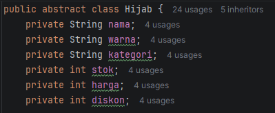

   Atribut diubah menjadi public abstract class.

4. Getter dan Setter

   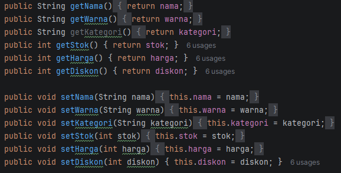

   Getter digunakan untuk mengambil nilai atribut, dan setter digunakan untuk mengubah nilai atribut.

5. Class Kategori Hijab dan Getter
   
   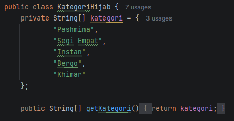

   diubah menjadi private dan ditambahkan getter agar tidak diakses langsung dari luar.

6. Fitur Program

    #### Tambah Data (Menambahkan data hijab baru ke dalam sistem)

   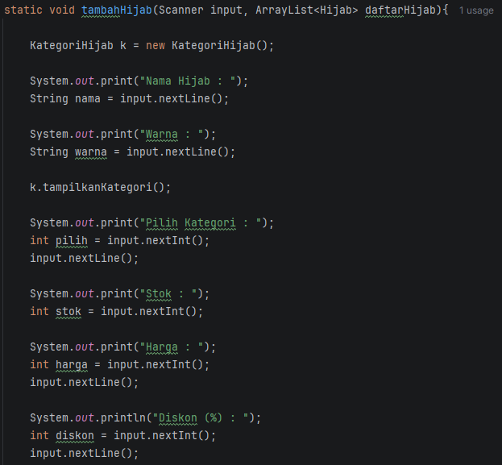

   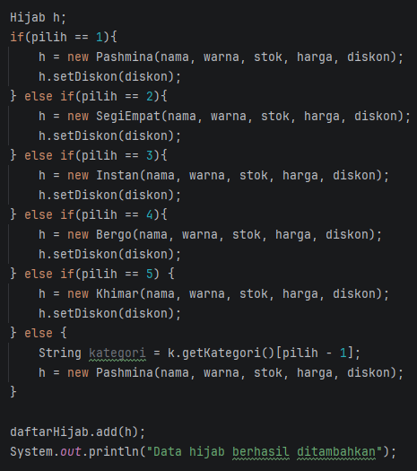

   Menu di atas digunakan untuk menambahkan data hijab baru pada sistem
      
   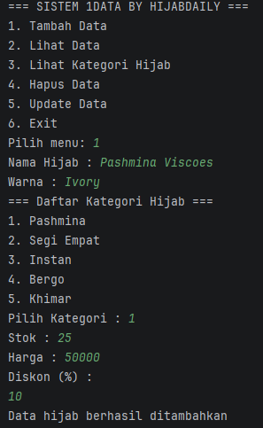

   Gambar di atas merupakan output dari menu tambah data, kita bisa menginputkan nama, warna, memillih kategori, jumlah stok, dan harga.

    #### Lihat Data (Menampilkan daftar seluruh produk hijab yang tersimpan)

   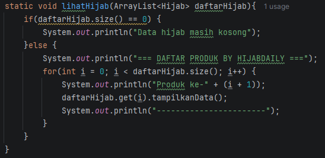

   Menu di atas digunakan untuk melihat data hijab yang sudah ada pada sistem

   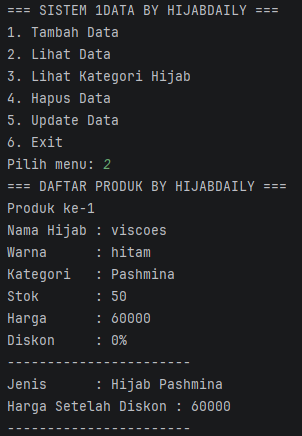

   Gambar di atas merupakan output dari menu lihat data, yang ditampilkan berupa nama hijab, warna, kategori, stok, dan harga.

   #### Lihat Kategori Hijab

   

      Menu di atas digunakan untuk melihat kategori hijab yang ada pada Toko HijabDaily

   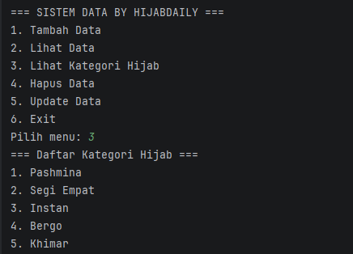

      Gambar di atas merupakan output dari menu lihat kategori hijab, berisi daftar kategori hijab yang ada di Toko HijabDaily, yaitu pashmina, segi empat, instan, bergo, dan khimar.
   
   #### Hapus Data (Menghapus data hijab berdasarkan nomor produk hijab)

   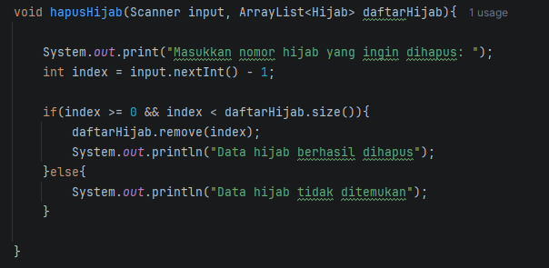

      Menu di atas digunakan untuk menghapus data hijab yang mungkin sudah tidak terdapat pada toko HijabDaily.

   

      Gambar di atas merupakan output dari menu Hapus Data, menu tersebut menggunakan nomor produk yang user input untuk menghapus datanya.

   #### Upadate Data (Mengubah data hijab yang sudah ada dengan menggunakan nomor produk hijab)

   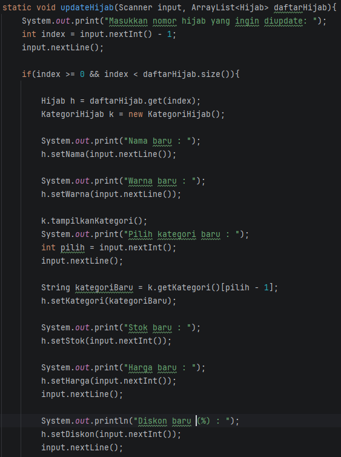

   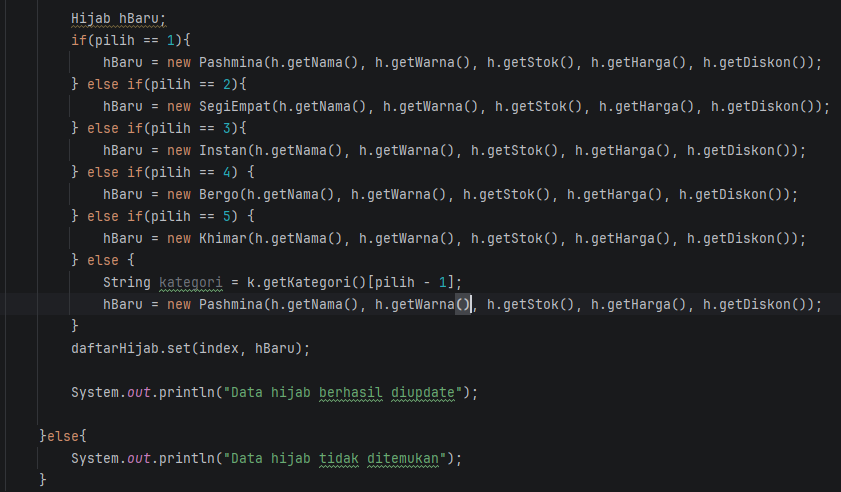

   Menu di atas digunakan untuk mengubah data hijab yang sudah ada pada sistem, misal memperbarui stok atau harga yang akan berubah seiring berjalannya toko dan mengaplikasikan setter.

   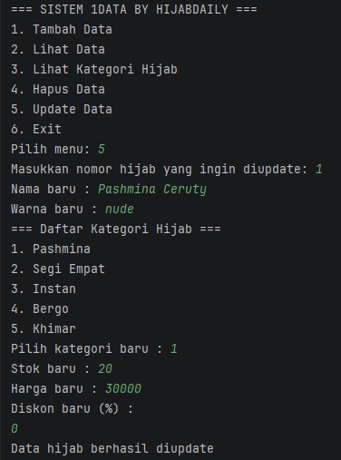

   Gambar di atas merupakan output dari menu update data, data di akses menggunakan nomor produk (index), kemudian menginputkan kembali nama, warna, kategori, stok, dan harga yang baru

   #### Exit (Keluar dari program)

   

   Menu di atas digunakan untuk menyelesaikan sesi penggunaan sistem dan keluar dari main menu.

   

   Gambar di atas merupakan output dari menu exit berupa pesan "Program selesai" dan langsung keluar dari program.

   

   Gambar di atas merupakan tampilan output apabila kita menginputkan menu yang tidak ada di dalam pilihan, yaitu berupa pesan "Menu tidak tersedia"

7. Struktur Class
    
    a. Class Hijab memiliki beberapa atribut, yaitu nama, warna, kategori, stok, harga, diskon. Class ini juga memiliki method untuk menampilkan data hijab.

    b. Class Kategori Hijab memiliki nama macam-macam kategori hijab yang ada di Toko HijabDaily dan satu method untuk menampilkan kategori hijab.

8. Penerapan Inheritance

   Superclass:

   Hijab {nama, warna, kategori, stok, harga, diskon, tampilkanData()}
   
   Subclass:

   (Pashmina, SegiEmpat, Bergo, Instan, Khimar) -> Jenis atau Kategori Hijab

   a. Subclass SegiEmpat

   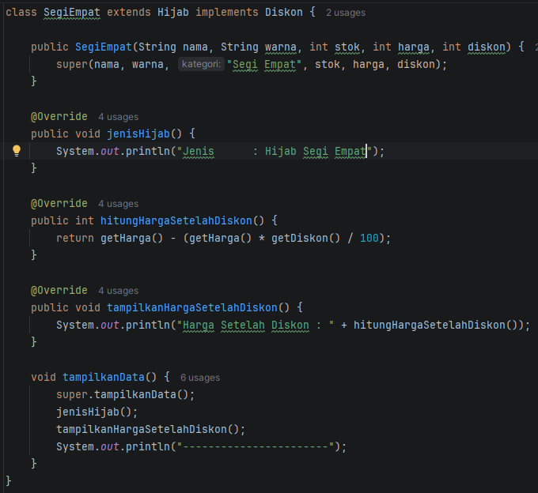

   b. Subclass Pashmina

   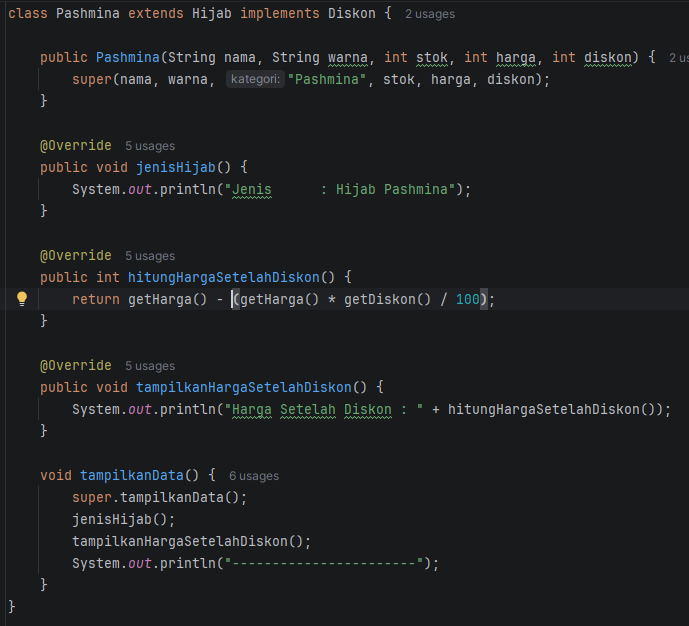

   c. Subclass Bergo

   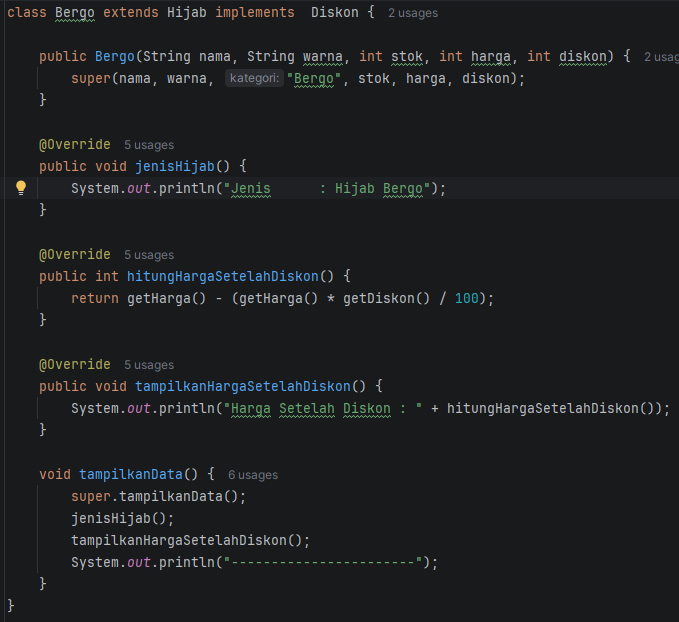

   d. Subclass Instan

   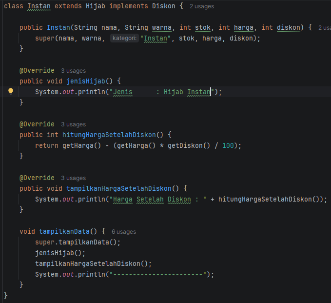

   e. Subclass Khimar

   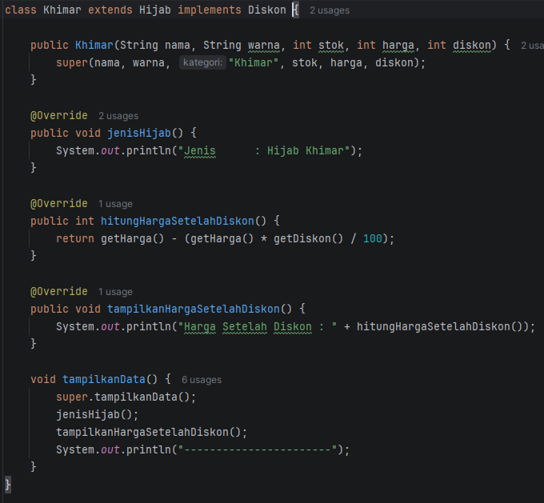

9. Penerapan Interface

   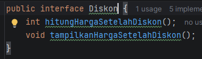

